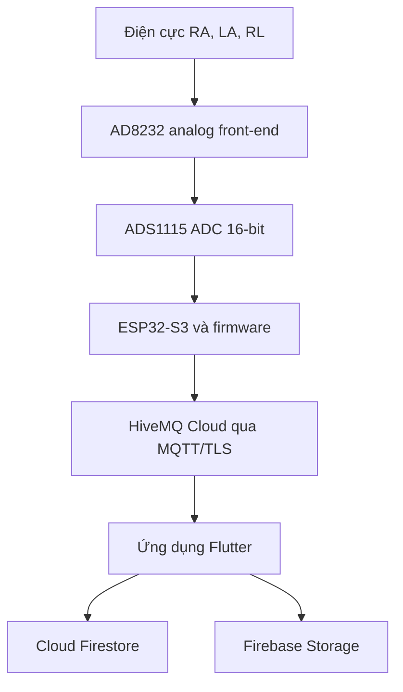
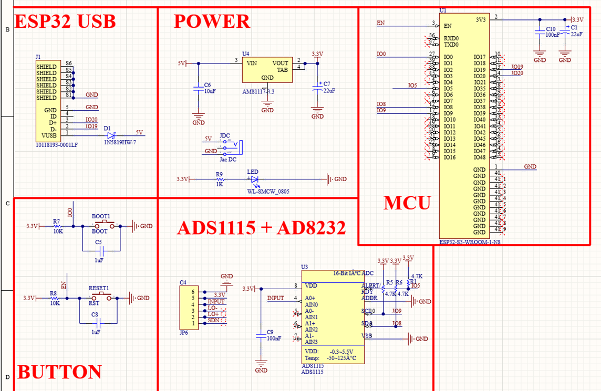
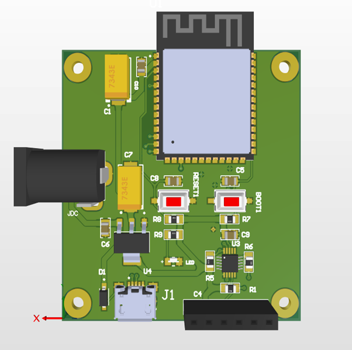

# Heart Protect - Hệ thống IoT giám sát ECG

Đây là repository ứng dụng di động của đồ án tốt nghiệp **“Thiết kế hệ thống giám sát tín hiệu điện tim ECG sử dụng ESP32 và ứng dụng di động”**. Hệ thống hoàn chỉnh gồm thiết bị đo ECG trên PCB tự thiết kế, firmware xử lý tín hiệu thời gian thực, truyền dữ liệu MQTT và ứng dụng Flutter để hiển thị, quản lý bệnh nhân và lưu trữ kết quả.

> Hệ thống là nguyên mẫu phục vụ học tập và nghiên cứu, chưa phải thiết bị y tế được chứng nhận và không được sử dụng để tự chẩn đoán.

## Chức năng chính

- Thu nhận tín hiệu ECG từ ba điện cực RA, LA, RL bằng module AD8232.
- Số hóa ECG bằng ADC ngoài ADS1115 16-bit ở 250 SPS.
- Phát hiện đỉnh R bằng thuật toán Pan-Tompkins trên ESP32-S3.
- Tính nhịp tim BPM, khoảng RR/IBI và các chỉ số HRV gồm SDNN, RMSSD.
- Gửi từng batch 25 mẫu ECG lên HiveMQ Cloud qua MQTT/TLS.
- Hiển thị dạng sóng ECG, HR và HRV gần thời gian thực trên ứng dụng Flutter.
- Đăng ký, đăng nhập email/mật khẩu hoặc Google và đặt lại mật khẩu.
- Quản lý hồ sơ bệnh nhân, lưu và xem lại từng phiên đo.
- Lưu metadata trên Cloud Firestore; lưu toàn bộ ECG/RR dạng JSON trên Firebase Storage.

## Kiến trúc hệ thống



Luồng xử lý dữ liệu:

1. AD8232 thu nhận, khuếch đại và lọc analog sơ cấp tín hiệu ECG.
2. Ngõ ra AD8232 được đưa vào kênh A0 của ADS1115.
3. ADS1115 chuyển đổi liên tục ở 250 SPS và báo mẫu mới bằng chân ALERT/RDY.
4. ESP32-S3 đọc mẫu qua I²C, làm mượt tín hiệu và chạy Pan-Tompkins trên dữ liệu thô.
5. Firmware tính BPM, RR/IBI, SDNN, RMSSD và đưa batch vào FreeRTOS queue.
6. `MQTT_Task` đóng gói JSON và publish lên topic `ecg/data`.
7. Ứng dụng Flutter subscribe topic, vẽ ECG và tích lũy dữ liệu cho phiên đo.
8. Khi người dùng lưu kết quả, app ghi metadata vào Firestore và file ECG/RR vào Storage.

## Phần cứng ECG Device

Thiết bị được triển khai trên **PCB hai lớp tự thiết kế**. ESP32-S3, ADS1115, nguồn, USB và các linh kiện phụ được tích hợp trên PCB; AD8232 là module có sẵn duy nhất được cắm vào header của mạch để giảm rủi ro ở khối analog trong giai đoạn nguyên mẫu.

### Schematic tổng thể

<p align="center">
  
</p>

Schematic thể hiện các khối USB Type-C, nguồn 5 V/3.3 V, ESP32-S3, BOOT/RESET và ADS1115 kết nối với module AD8232.

### Mô hình PCB 3D

<p align="center">
  
</p>

### Thành phần chính

| Thành phần | Vai trò và cấu hình trong hệ thống |
| --- | --- |
| ESP32-S3 | Bộ xử lý trung tâm, chạy Pan-Tompkins/HRV, FreeRTOS và truyền MQTT qua Wi-Fi 2.4 GHz |
| ADS1115 | ADC ngoài 16-bit, continuous mode, 250 SPS, PGA `±4.096 V`, địa chỉ I²C `0x48` |
| AD8232 | Analog front-end ECG một kênh, nhận điện cực RA/LA/RL và xuất tín hiệu analog |
| AMS1117-3.3 | Hạ nguồn 5 V từ USB/jack xuống 3.3 V cho ESP32-S3, ADS1115 và AD8232 |
| USB Type-C | Cấp nguồn, nạp firmware và debug Serial qua D+/D- |
| BOOT/RESET | Vào bootloader, khởi động lại thiết bị và kích hoạt cấu hình lại Wi-Fi |

### Kết nối phần cứng

| Tín hiệu | Kết nối | Chức năng |
| --- | --- | --- |
| AD8232 OUT | ADS1115 A0 | Đưa tín hiệu ECG analog vào ADC |
| ADS1115 SDA | ESP32-S3 GPIO8 | Dữ liệu I²C |
| ADS1115 SCL | ESP32-S3 GPIO9 | Clock I²C |
| ADS1115 ALERT/RDY | ESP32-S3 GPIO5 | Ngắt DRDY báo mẫu ADC mới |
| ADS1115 ADDR | GND | Chọn địa chỉ I²C `0x48` |
| AD8232 VCC, ADS1115 VDD | 3.3 V | Nguồn cho khối ECG và ADC |
| AD8232 GND, ADS1115 GND | GND chung | Mass tham chiếu hệ thống |
| USB Type-C/jack nguồn | 5 V | Cấp nguồn đầu vào và nạp chương trình |

Khi layout PCB, đường analog từ AD8232 tới ADS1115 được ưu tiên ngắn, tránh chạy song song với đường số; bus I²C được giữ ngắn và tách khỏi vùng đầu vào ECG. Tụ lọc được đặt gần chân nguồn và mặt GND được tổ chức để hạn chế nhiễu.

## Firmware ESP32-S3

Firmware được viết bằng C/C++ với PlatformIO và Arduino framework. Source firmware chưa nằm trong repository này, nhưng báo cáo tổ chức firmware thành các module:

| Module | File trong firmware | Chức năng |
| --- | --- | --- |
| Main | `main.cpp`, `main.h` | Khởi tạo hệ thống, đọc ECG, tạo queue và task MQTT |
| ADS1115 | `ads_1115.cpp/.h` | Cấu hình ADC, đọc DRDY và đổi raw ADC sang điện áp |
| Moving Average | `moving_average.cpp/.h` | Làm mượt dạng sóng gửi lên ứng dụng |
| Pan-Tompkins | `pantompskin.cpp`, `pan_tompskins.h` | Lọc số, đạo hàm, bình phương, tích phân và phát hiện đỉnh R |
| HRV | `hrv.cpp/.h` | Lưu RR hợp lệ và tính SDNN, RMSSD |
| MQTT | `mqtt_manager.cpp/.h` | Duy trì kết nối và publish payload JSON |
| Wi-Fi | `wifi_manager.cpp/.h` | Kết nối và cấu hình Wi-Fi động |

### Tham số xử lý

| Tham số | Giá trị |
| --- | --- |
| Tần số lấy mẫu | 250 SPS |
| Chế độ ADS1115 | Continuous conversion |
| Kênh ADC | A0 |
| Moving average | 10 mẫu |
| Bộ lọc thông thấp Pan-Tompkins | Butterworth bậc 4, khoảng 11 Hz |
| Bộ lọc thông cao Pan-Tompkins | Butterworth bậc 4, khoảng 5 Hz |
| Cửa sổ tích phân `MWI_SIZE` | 38 mẫu, khoảng 152 ms |
| Refractory period | 50 mẫu, khoảng 200 ms |
| Khoảng RR hợp lệ | 300-1500 ms |
| Batch MQTT | 25 mẫu, tương đương 0.1 giây |
| FreeRTOS queue | 20 `EcgBatch` |
| HRV window | 1000 khoảng RR |
| Điều kiện HRV live trên firmware | Tối thiểu 300 khoảng RR hợp lệ |

### Xử lý realtime

Vòng lặp lấy mẫu ưu tiên đọc ADS1115 theo cờ DRDY, xử lý tín hiệu và tạo batch. Khi đủ 25 mẫu, batch được đẩy vào queue; `MQTT_Task` nhận dữ liệu, kiểm tra broker và publish độc lập. Cách tách này tránh thao tác mạng hoặc reconnect MQTT làm gián đoạn chu kỳ lấy mẫu 250 Hz.

Firmware sử dụng WiFiManager để lưu cấu hình mạng trong flash/NVS. Khi chưa có mạng hoặc kết nối thất bại, thiết bị mở captive portal để cấu hình Wi-Fi. Giữ nút BOOT khoảng 3 giây cho phép xóa cấu hình cũ và thiết lập lại mạng.

## Ứng dụng Flutter

Ứng dụng có ba nhóm chức năng chính:

- **Tài khoản:** đăng ký, đăng nhập, Google Sign-In, quên mật khẩu và đăng xuất.
- **Đo ECG:** kết nối MQTT, hiển thị 500 điểm gần nhất (khoảng 2 giây), HR/HRV và trạng thái phiên đo.
- **Bệnh nhân:** thêm, sửa, xóa hồ sơ; lưu và xem lại dạng sóng cùng kết quả HRV của từng phiên.

Khi kết thúc phiên đo, ứng dụng tính lại SDNN, RMSSD và IBI trung bình từ toàn bộ chuỗi RR/IBI. Code hiện yêu cầu phiên đo tối thiểu 5 phút và ít nhất 120 khoảng RR/IBI trước khi cho lưu đánh giá HRV cuối phiên.

## Giao tiếp MQTT

| Thuộc tính | Giá trị |
| --- | --- |
| Broker | HiveMQ Cloud |
| Port | `8883` |
| Bảo mật | TLS |
| Topic | `ecg/data` |
| QoS | 0 - at most once |
| Payload | JSON, 25 mẫu ECG mỗi bản tin |

Ví dụ payload:

```json
{
  "ecg": [1.2345, 1.2360, 1.2401],
  "hr": 72.0,
  "sdnn": 75.6,
  "rmssd": 84.5,
  "ibi": 792.0
}
```

| Trường | Kiểu | Đơn vị/ý nghĩa |
| --- | --- | --- |
| `ecg` | `List<double>` | Các mẫu ECG đã lọc trung bình trượt |
| `hr` | `double` | Nhịp tim hiện tại, BPM |
| `sdnn` | `double` | SDNN tính từ chuỗi RR hợp lệ, ms |
| `rmssd` | `double` | RMSSD tính từ sai khác RR liên tiếp, ms |
| `ibi` | `double` | Khoảng RR/IBI mới nhất, ms |

## Firebase

```text
Firebase Authentication
users/{uid}
└── patients/{patientId}
    └── recordings/{recordingId}
```

Metadata của bản ghi gồm HR, thời lượng, số mẫu, SDNN, RMSSD, IBI, thông tin đánh giá và đường dẫn file. Dữ liệu đầy đủ được lưu trên Firebase Storage:

```text
users/{uid}/patients/{patientId}/recordings/{recordingId}/ecg.json
users/{uid}/patients/{patientId}/recordings/{recordingId}/rr.json
```

Việc tách metadata và file mẫu giúp tránh document Firestore quá lớn và thuận tiện khi tải lại bản ghi.

## Kết quả kiểm thử trong đồ án

- Các ca kiểm thử đăng nhập, Google Sign-In, quên mật khẩu, MQTT, hiển thị ECG, lưu/xem lại bản ghi và đăng xuất đều đạt kết quả mong đợi.
- Thiết bị publish đúng topic và cấu trúc JSON; ứng dụng cập nhật đồ thị gần thời gian thực.
- Trong phép đo đối chiếu, ứng dụng hiển thị khoảng **72 BPM**, tương đương vùng giá trị của smartwatch tại cùng thời điểm. Đây chỉ là so sánh tham khảo do hai thiết bị sử dụng nguyên lý đo khác nhau.
- Với phiên đo khoảng 5 phút chứa 333 khoảng RR, ứng dụng tính **SDNN = 69.7 ms**, **RMSSD = 42.4 ms**, **IBI trung bình = 897.3 ms**. SDNN và RMSSD trùng với kết quả của công cụ HRV tham chiếu khi sử dụng cùng file `rr.json`.

Các kết quả trên xác nhận luồng xử lý hoạt động đúng trong kịch bản thử nghiệm, không phải tuyên bố về độ chính xác lâm sàng.

### Cấu trúc source Flutter

```text
lib/
├── main.dart                 # Khởi tạo Firebase và ứng dụng
├── models/                   # User, patient và ECG recording models
├── screens/                  # Đăng nhập, đo ECG và quản lý bệnh nhân
├── services/                 # Authentication, MQTT, Firestore và Storage
├── utils/                    # Khoảng tham chiếu và đánh giá HRV
└── widgets/                  # CustomPainter hiển thị ECG
```

## Cài đặt ứng dụng

### Yêu cầu

- Flutter SDK tương thích với Dart `^3.11.1`.
- Android Studio hoặc Xcode nếu chạy trên thiết bị di động.
- JDK 17 khi build Android.
- Firebase project đã bật Authentication, Cloud Firestore và Storage.
- MQTT broker và ECG Device publish đúng payload nêu trên.

### Chạy project

```bash
git clone https://github.com/quochuyii1305/data_version2.git
cd data_version2
flutter pub get
flutter run
```

Nếu sử dụng Firebase project khác:

```bash
flutterfire configure
```

Sau đó bật Email/Password, cấu hình Google Sign-In, tạo Firestore/Storage và thiết lập Security Rules. Linux hiện chưa được cấu hình trong `firebase_options.dart`.

### Cấu hình MQTT của ứng dụng

Thông số broker nằm trong `MqttConfig` tại `lib/services/mqtt_service.dart`:

```dart
class MqttConfig {
  static const String host = 'YOUR_BROKER_HOST';
  static const String username = 'YOUR_USERNAME';
  static const String password = 'YOUR_PASSWORD';
  static const int port = 8883;
  static const bool useTls = true;
  static const String clientId = 'YOUR_UNIQUE_CLIENT_ID';
  static const String ecgTopic = 'ecg/data';
}
```

Mỗi client kết nối đồng thời phải có `clientId` riêng. Không commit credential thật vào repository công khai; cần thay thông tin đã từng bị lộ và chuyển secret sang cấu hình build/runtime trước khi triển khai.

## Kiểm tra source

```bash
flutter analyze
flutter test
dart format lib test
```

## An toàn và giới hạn

- Không gắn điện cực lên người khi PCB đang nối với USB, debugger, oscilloscope hoặc thiết bị tham chiếu lưới điện nếu chưa có cách ly điện đáp ứng yêu cầu an toàn.
- Nguyên mẫu chưa được kiểm chuẩn với thiết bị ECG y tế và chưa đáp ứng tiêu chuẩn thiết bị y sinh.
- HR/HRV phụ thuộc chất lượng tiếp xúc điện cực, chuyển động, nhiễu nguồn, thời lượng đo và độ chính xác phát hiện đỉnh R.
- Cần đo định lượng thêm độ trễ, tỷ lệ mất gói MQTT và độ chính xác trên nhiều người dùng/dữ liệu chuẩn.

## Hướng phát triển

- Cải thiện lọc nhiễu nguồn, trôi đường nền và nhiễu chuyển động.
- Bổ sung cơ chế tìm lại QRS bị bỏ sót và kiểm chuẩn với thiết bị/dataset ECG chuẩn.
- Thêm cảnh báo tín hiệu bất thường hoặc nhịp tim vượt ngưỡng.
- Tính thêm pNN50 và các chỉ số HRV miền tần số.
- Xây dựng dashboard web/backend riêng để quản lý nhiều thiết bị và bệnh nhân.
- Hoàn thiện Firebase Security Rules và quản lý credential an toàn.

## Tài liệu linh kiện

- [ESP32-S3 Datasheet - Espressif](https://www.espressif.com/sites/default/files/documentation/esp32-s3_datasheet_en.pdf)
- [ADS1115 Datasheet - Texas Instruments](https://www.ti.com/lit/ds/symlink/ads1115.pdf)
- [AD8232 Datasheet - Analog Devices](https://www.analog.com/media/en/technical-documentation/data-sheets/ad8232.pdf)
